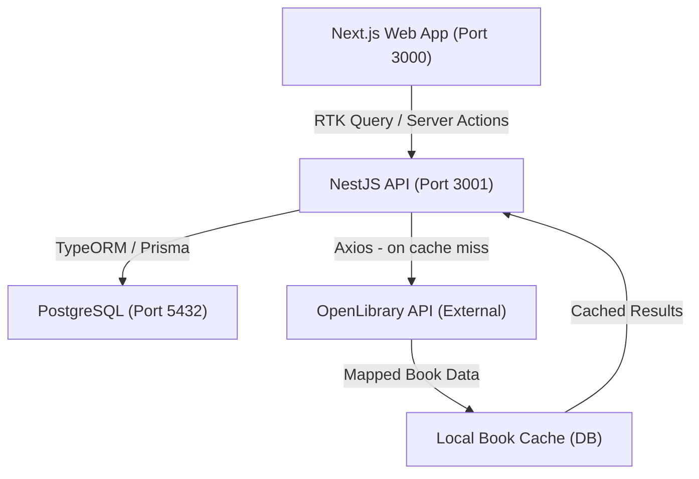

## Target Users

| Persona | Goal |
|---|---|
| **Book Enthusiast** | Discover books, track reading progress, write reviews |
| **Admin (Optional)** | Moderate reviews, manage books |
| **Developer (Self)** | Learn and validate full-stack architecture skills |

## Success Metrics

- **Functional completeness**: Full user flow — Register → Login → Search Books → Update Status → Write Review.
- **Backend quality**: Modular NestJS app with JWT auth, RBAC guards, DTO validation, OpenLibrary integration.
- **Frontend quality**: Next.js app with App Router, SSR, protected routes, Redux Toolkit + RTK Query.
- **Data integrity**: Normalized PostgreSQL schema; no duplicate reviews per user/book.
- **Test coverage**: Unit tests for services/guards, integration tests for endpoints, optional E2E smoke path.
- **Deployment**: Dockerized application (PostgreSQL in Docker), optionally deployed via SST.

## Project Scope, Main Features & User Flows *(PDP 1.1)*

**Scope**: Book Tracking Platform — web app for discovering books (OpenLibrary), tracking reading status (planned / reading / completed), writing reviews and 1–5 ratings, and managing favorites. Users: Book Enthusiast, optional Admin. Out of scope: social features, pre-seeded catalog, mobile app.

**Main features** (by capability):
- **Identity**: Registration, Login, Token Refresh, RBAC (user/admin).
- **Books**: External search (OpenLibrary), catalog with pagination/filters, book detail, local caching.
- **User interaction**: Reading status per book, reviews (CRUD own), ratings 1–5 (aggregate), favorites toggle.
- **Frontend**: Auth pages, protected routes, catalog, book detail, dashboard by status, reusable UI (Annex 1–3).
- **Quality & release**: Unit/integration tests, optional E2E, Docker, optional SST deploy.

**User flows**:
1. **Onboarding**: Visit app → Sign up → Login → Redirect to dashboard.
2. **Discover & track**: Login → Search books → Open book detail → Set status (planned/reading/completed) → (optional) Add to favorites.
3. **Engage**: Book detail → Submit or edit rating (1–5) → Write or edit review → See aggregate rating and reviews.
4. **Dashboard**: Login → Dashboard → See lists by status (Planned / Reading / Completed) → Change status or open book.
5. **Admin (optional)**: Login as admin → Delete any review (moderation).

</overview>

---

<functional-decomposition>

## Capability Tree

---

### Capability: Identity Management
Handles user authentication, authorization, and role-based access control.

#### Feature: User Registration
- **Description**: Create a new account with email + password.
- **Inputs**: `{ email, password, name }`
- **Outputs**: Created user record; Access + Refresh tokens.
- **Behavior**: Validate email uniqueness, hash password (bcrypt), issue JWT pair.

#### Feature: User Login
- **Description**: Authenticate an existing user.
- **Inputs**: `{ email, password }`
- **Outputs**: Access Token, Refresh Token.
- **Behavior**: Verify credentials, issue short-lived access token + long-lived HTTP-only refresh token.

#### Feature: Token Refresh
- **Description**: Issue a new access token using a valid refresh token.
- **Inputs**: Refresh token (HTTP-only cookie).
- **Outputs**: New access token.
- **Behavior**: Validate refresh token signature and expiry; rotate or reuse.

#### Feature: Role-Based Access Control (RBAC)
- **Description**: Restrict actions based on user role.
- **Inputs**: User role (`User`, `Admin`), target resource, action.
- **Outputs**: Allow / Deny.
- **Behavior**: NestJS Guards + Decorators enforce role requirements on routes.

---

### Capability: Book Management
Manages book data sourced from OpenLibrary and stored locally.

#### Feature: External Book Search (OpenLibrary)
- **Description**: Search books by title or author via OpenLibrary API.
- **Inputs**: Search query string.
- **Outputs**: List of standardized `Book` objects.
- **Behavior**: Call OpenLibrary API, map response to internal schema, cache locally to avoid redundant calls.

#### Feature: Catalog Browsing
- **Description**: Browse the local book catalog with pagination and filtering.
- **Inputs**: `{ page, limit, filters: { status?, rating?, favorites? } }`
- **Outputs**: Paginated list of books with aggregate ratings.
- **Behavior**: Server-side pagination; filter by user status, minimum rating, or favorite flag.

#### Feature: Book Detail
- **Description**: Return full book details including aggregate user ratings and review count.
- **Inputs**: `bookId`
- **Outputs**: `Book` object with `averageRating`, `reviewCount`.
- **Behavior**: Join book with aggregated review stats.

---

### Capability: User Interaction
Manages user-generated engagement with books.

#### Feature: Reading Status
- **Description**: Track a user's reading status for a specific book.
- **Inputs**: `{ bookId, status: 'planned' | 'reading' | 'completed' }`
- **Outputs**: Upserted `UserBookStatus` record.
- **Behavior**: One status record per (user, book) pair; upsert on update.

#### Feature: Reviews
- **Description**: Create, update, or delete a user's written review for a book.
- **Inputs**: `{ bookId, text }` for create/update; `reviewId` for delete.
- **Outputs**: `Review` object.
- **Behavior**: One review per (user, book); only owner can edit/delete; Admin can delete any.

#### Feature: Ratings
- **Description**: Submit or update a numeric rating (1–5) for a book.
- **Inputs**: `{ bookId, rating: 1 | 2 | 3 | 4 | 5 }`
- **Outputs**: Updated `Rating` record; recalculated book aggregate.
- **Behavior**: One rating per (user, book); triggers aggregate recalculation on book.

#### Feature: Favorites
- **Description**: Toggle a book as a favorite.
- **Inputs**: `{ bookId }`
- **Outputs**: Toggle boolean `isFavorite`.
- **Behavior**: Create or delete `Favorite` record for (user, book).

---

### Capability: Frontend Presentation
User-facing Next.js application for all platform interactions.

#### Feature: Auth Pages & Protected Routes
- **Description**: Login, Signup pages + route guards for authenticated areas.
- **Inputs**: User credentials via form.
- **Outputs**: Redirects to dashboard on success; redirect to login if unauthorized.
- **Behavior**: Redux stores auth state; middleware protects routes.

#### Feature: Catalog Page
- **Description**: Book grid with search, filters, and pagination.
- **Inputs**: User-driven search/filter/page inputs.
- **Outputs**: Rendered book list (cover, title, author, rating).
- **Behavior**: SSR for initial render; RTK Query for client-side interactions (Annex 1).

#### Feature: Book Detail Page
- **Description**: Full book info, reviews, rating form, and status selector.
- **Inputs**: `bookId` from URL.
- **Outputs**: Rendered book detail with user interaction options.
- **Behavior**: SSR for SEO; interactive rating/review forms via RTK Query.

#### Feature: User Dashboard
- **Description**: Personal reading lists by status.
- **Inputs**: Authenticated user context.
- **Outputs**: Lists of books by `planned`, `reading`, `completed` status.
- **Behavior**: Fetched server-side; status update triggers optimistic UI update.

#### Feature: Reusable UI Patterns
- **Description**: Shared components for all pages (Annex 3).
- **Outputs**: `<BookCard>`, `<PaginationControls>`, `<FilterBar>`, `<EmptyState>`, `<FormField>`.
- **Behavior**: Reusable, accessible, with loading and error states.

---

### Capability: Quality & Release
Ensures the platform is production-ready.

#### Feature: Testing
- **Description**: Automated test suite covering unit and integration layers.
- **Behavior**: Jest for backend services/guards; Supertest for API endpoints; optional Playwright E2E.

#### Feature: Infrastructure & Deployment
- **Description**: Containerized local environment + cloud deployment.
- **Behavior**: Docker Compose for PostgreSQL; SST for cloud deployment.

</functional-decomposition>

---

<structural-decomposition>

## Repository Structure

```
pdp-book-tracker/
├── apps/
│   ├── api/                        # NestJS Backend
│   │   ├── src/
│   │   │   ├── handlers/           # API layer (controllers)
│   │   │   ├── domains/            # Business logic by capability
│   │   │   │   ├── auth/           # JWT, Passport, guards, refresh
│   │   │   │   ├── users/
│   │   │   │   ├── books/          # OpenLibrary integration, cache
│   │   │   │   └── interactions/   # reviews, ratings, statuses, favorites
│   │   │   ├── entities/           # ORM entities (User, Book, Review, Rating, etc.)
│   │   │   ├── common/             # Filters, interceptors, pipes, decorators
│   │   │   ├── config/             # ConfigModule, env validation
│   │   │   └── database/           # TypeORM/Prisma setup, migrations
│   │   └── test/                   # E2E tests (Supertest)
│   └── web/                        # Next.js 15 Frontend (App Router)
│       ├── app/                    # Routes and layouts
│       │   ├── (auth)/             # Login, Signup pages
│       │   ├── (protected)/        # Dashboard, Catalog, Book Detail
│       │   └── layout.tsx
│       ├── components/             # Reusable UI (BookCard, PaginationControls, FilterBar…)
│       ├── lib/
│       │   ├── store/              # Redux Toolkit store
│       │   └── api/                # RTK Query endpoints
│       └── types/                  # Shared TypeScript types
├── docker-compose.yml
├── package.json                    # Monorepo root (pnpm workspaces or Turborepo)
└── README.md
```

**Backend (`apps/api/src`) layout:**
- **handlers** — API layer (controllers); HTTP entrypoints, delegate to domains.
- **domains** — Business logic by capability (auth, users, books, interactions); services, DTOs, domain rules.
- **entities** — ORM entities only (User, Book, Review, Rating, ReadingStatus, Favorite).

## Module Definitions

### Module: Common / Core
- **Maps to capability**: Cross-cutting concerns
- **Responsibility**: Global exception filter, response interceptors, validation pipes, shared decorators, logging.
- **Exports**: `HttpExceptionFilter`, `TransformInterceptor`, `ValidationPipe config`, `CurrentUser` decorator.

### Module: Config
- **Maps to capability**: Cross-cutting concerns
- **Responsibility**: Load and validate environment variables using `@nestjs/config` + `joi`.
- **Exports**: `ConfigService` with typed accessors.

### Module: Database
- **Maps to capability**: Cross-cutting concerns
- **Responsibility**: TypeORM/Prisma connection, entity registration, migration management.
- **Exports**: Database connection; entity repositories via DI.

### Module: Auth
- **Maps to capability**: Identity Management
- **Responsibility**: Issue tokens, validate JWT, refresh token rotation, Passport strategies.
- **Exports**: `AuthService`, `JwtAuthGuard`, `RolesGuard`, `@Roles()` decorator.

### Module: Users
- **Maps to capability**: Identity Management
- **Responsibility**: User CRUD, profile management.
- **Exports**: `UsersService`, `User` entity.

### Module: Books
- **Maps to capability**: Book Management
- **Responsibility**: Local book catalog, OpenLibrary integration, caching, pagination.
- **Exports**: `BooksService`, `BooksController`, `Book` entity.

### Module: Interactions
- **Maps to capability**: User Interaction
- **Responsibility**: Reading statuses, reviews, ratings, favorites.
- **Sub-modules**: `reviews/`, `ratings/`, `statuses/`, `favorites/`
- **Exports**: All sub-controllers; `InteractionsModule`.

### Module: Web App (Next.js)
- **Maps to capability**: Frontend Presentation
- **Responsibility**: Render UI, manage auth state via Redux, fetch data with RTK Query or Server Actions.

</structural-decomposition>

---

<dependency-graph>

## Dependency Chain

### Foundation Layer (Phase 0) — No Dependencies
- **Config Module**: Provides typed env access. Depends on: _none_.
- **Database Module**: Provides ORM setup. Depends on: _Config_.
- **Common Module**: Provides shared utilities. Depends on: _none_.

### Core Layer (Phase 1)
- **Users Module**: Depends on [Database, Config, Common].
- **Auth Module**: Depends on [Users Module, Config, Common].
  - Implements JWT strategy, Passport, guards, refresh token lifecycle.

### Feature Layer (Phase 2)
- **Books Module**: Depends on [Database, Config, HttpModule (Axios)].
  - Independent of Auth in data layer; routes protected by Auth guards.
- **Interactions Module**: Depends on [Books Module, Users Module, Auth Module].
  - Requires authenticated users and existing book records.

### Presentation Layer (Phase 3)
- **Web App (Next.js)**: Depends on [All API Endpoints].
  - Auth flows → Auth API.
  - Catalog / Search → Books API.
  - Status / Reviews / Ratings / Favorites → Interactions API.

### Release Layer (Phase 4)
- **Testing**: Depends on [All modules built].
- **Deployment (SST)**: Depends on [Passing test suite, Docker setup].

</dependency-graph>

---

<implementation-roadmap>

## Development Phases

### Phase 0: Project Initialization & Foundation
**Goal**: Establish the monorepo, tooling, database, and project structure.  
**PDP Alignment**: Goals 1.1 → 1.5 | Practice 1.0, 1.1, 1.2, 1.3  
**Entry Criteria**: Empty repository.

**Tasks**:
- [ ] Define project scope, features, and user flows *(PDP 1.1)*
  - *Acceptance*: PRD document complete and attached.
- [ ] Design DB schema: `Users`, `Books`, `Reviews`, `Ratings`, `ReadingStatuses`, `Favorites` *(Practice 1.1)*
  - *Acceptance*: ERD diagram created; normalization confirmed.
- [ ] Initialize monorepo (pnpm workspaces or Turborepo) *(Practice 1.2)*
  - *Acceptance*: `apps/api` and `apps/web` exist; root `package.json` resolves workspaces.
- [ ] Learn relational modeling: entity relationships, normalization, index types, pagination patterns *(PDP 1.2)*
- [ ] Design architecture for Book Tracking Platform *(PDP 1.3)*
- [ ] Learn core NestJS blocks: modules, controllers, providers, decorators, dependency injection *(PDP 1.4)*
- [ ] Initialize NestJS project (ESLint, Prettier, env config) *(Practice 1.3)*
  - *Acceptance*: `nest start` runs; health endpoint responds.
- [ ] Initialize Next.js project (TypeScript, App Router, Tailwind) *(Practice 1.3)*
  - *Acceptance*: `next dev` runs; root page renders.
- [ ] Configure Docker Compose for PostgreSQL *(Practice 1.3)*
  - *Acceptance*: `docker compose up` starts DB; NestJS connects.
- [ ] Set up GitHub repo, commit hooks, lint-staged *(Practice 1.3)*

**Exit Criteria**: Both apps start locally; DB is accessible; linting and formatting pass.

---

### Phase 1: Backend — Auth & Users
**Goal**: Secure identity management layer.  
**PDP Alignment**: Goal 2.1, 2.2 | Practice 2.1  
**Entry Criteria**: Phase 0 complete.

**Tasks**:
- [ ] Learn NestJS auth strategy: JWT, refresh tokens, RBAC, guards/decorators *(PDP 2.1)*
- [ ] Learn Passport strategies, guards, custom decorators, access/refresh token lifecycle *(PDP 2.1)*
- [ ] Implement `Users` module (entity, service, controller) *(depends on: Database)*
- [ ] Implement `Auth` module: registration, login via Passport Local *(depends on: Users)*
- [ ] Implement JWT access token + HTTP-only refresh token flow *(PDP 2.2)*
- [ ] Implement Role-Based Access Control (Guards, `@Roles()` decorator) *(PDP 2.2)*
- [ ] Implement DTO validation (class-validator), global pipes, exception filters *(PDP 2.2)*
  - *Acceptance*: `/auth/register`, `/auth/login`, `/auth/refresh`, `/auth/logout` all working.
- [ ] Protected route test: unauthorized → 401, authorized → 200.

**Exit Criteria**: Users can register, login, and access protected routes; refresh token rotates correctly.

---

### Phase 2: Backend — Books & Interactions
**Goal**: Core domain features — book management and user interactions.  
**PDP Alignment**: Practice 2.1 (API layer) | Annex 1, 2  
**Entry Criteria**: Phase 1 complete; Auth is robust.

**Tasks**:
- [ ] Implement `Books` module with OpenLibrary integration (Axios + HttpModule) *(Practice 2.1)*
  - *Acceptance*: `GET /books/search?q=harry+potter` returns mapped results.
- [ ] Implement local caching strategy: book records saved to DB on first fetch *(Practice 2.1)*
- [ ] Implement server-side pagination + filtering for catalog *(Annex 1)*
  - *Acceptance*: `GET /books?page=1&limit=20&sort=rating` returns paginated list.
- [ ] Implement `ReadingStatus` endpoint: upsert per (user, book) *(Annex 2)*
- [ ] Implement `Reviews` CRUD (create / update / delete own; Admin deletes any) *(Annex 2)*
  - *Acceptance*: Duplicate review rejected (409).
- [ ] Implement `Ratings` (1–5): upsert + aggregate recalculation *(Annex 2)*
- [ ] Implement `Favorites` toggle *(Annex 2)*
- [ ] Add Swagger/OpenAPI documentation.

**Exit Criteria**: Full API lifecycle: Search → Add to list → Rate → Review.

---

### Phase 3: Frontend — Next.js Application
**Goal**: User interface connecting to the full API.  
**PDP Alignment**: Goals 3.1–3.3 | Practice 3 | Annex 1, 2, 3  
**Entry Criteria**: Phase 2 complete; API documented.

**Tasks**:
- [ ] Learn App Router, Layouts, Templates, Server Components *(PDP 3.1)*
- [ ] Learn rendering strategies: SSR, SSG, Server Actions, caching basics *(PDP 3.2)*
- [ ] Set up Redux Toolkit store + RTK Query for API calls *(PDP 3.3)*
- [ ] Build Login & Signup pages; implement protected route middleware *(PDP 3.3)*
  - *Acceptance*: Unauthenticated → redirect to `/login`.
- [ ] Build Catalog Page: book grid, search bar, filter bar, pagination *(Annex 1)*
  - Components: `<BookCard>`, `<FilterBar>`, `<PaginationControls>` *(Annex 3)*
- [ ] Build Book Detail Page: book info, reviews list, rating form, status selector *(Annex 2)*
- [ ] Build User Dashboard: reading lists by status *(Annex 2)*
- [ ] Implement reusable patterns: empty states, error states, loading skeletons *(Annex 3)*
- [ ] Implement complex business logic: status transitions, duplicate review prevention

**Exit Criteria**: Fully navigable application; all core flows work end-to-end.

---

### Phase 4: Full Application Release
**Goal**: Tested, deployable, production-quality application.  
**PDP Alignment**: Goals 4.1, 4.2 | Practice 4.1  
**Entry Criteria**: Phase 3 complete.

**Tasks**:
- [ ] Learn and apply test strategy for full-stack apps *(PDP 4.1)*
- [ ] Write unit tests: Services, Guards, Pipes (Jest) *(Practice 4.1)*
- [ ] Write integration tests: API endpoints with Test DB (Supertest) *(Practice 4.1)*
- [ ] Set up pre-merge quality checks: lint + tests in CI *(Practice 4.1)*
- [ ] Optional: Basic E2E smoke path (Playwright) *(Practice 4.1)*
- [ ] Learn SST for cloud deployment *(PDP 4.2)* — [sst.dev](https://sst.dev/)
- [ ] Deploy application via SST (or Docker on cloud provider)

**Exit Criteria**: All tests pass; app is deployable; CI pipeline is green.

</implementation-roadmap>

---

<test-strategy>

## Test Pyramid

```
         /\
        /E2E\       ← 10% (Critical smoke paths – optional per PDP)
       /------\
      /Integra-\    ← 30% (API endpoint tests via Supertest + Test DB)
     /tion Tests\
    /------------\
   /  Unit Tests  \ ← 60% (Services, Guards, Pipes, Components – Jest/Vitest)
  /----------------\
```

## Coverage Requirements
- Line coverage: **70%** minimum (backend services and guards)
- Function coverage: **80%** minimum

## Critical Test Scenarios

### Auth Module
| Scenario | Expected |
|---|---|
| Happy path: Register → Login → Access protected route | 200 OK with user data |
| Login with wrong password | 401 Unauthorized |
| Access protected route without token | 401 Unauthorized |
| Refresh token flow | New access token issued |
| Expired refresh token | 401, must re-login |

### Books Module
| Scenario | Expected |
|---|---|
| Search "Harry Potter" → fetches from OpenLibrary | Returns mapped list |
| Same search again | Returns from local DB cache (no external call) |
| OpenLibrary API unavailable | Returns cached results or 503 with error message |

### Interactions Module
| Scenario | Expected |
|---|---|
| User adds a book with status `planned` | 201 with status record |
| User attempts to review a book twice | 409 Conflict |
| Rating out of 1–5 range | 400 Bad Request |
| User deletes own review | 200 OK |
| User deletes another user's review | 403 Forbidden |
| Admin deletes any review | 200 OK |

</test-strategy>

---

<architecture>

## System Components



## Data Models

### Users
| Field | Type | Notes |
|---|---|---|
| `id` | UUID | PK |
| `email` | string | Unique |
| `passwordHash` | string | bcrypt |
| `name` | string | |
| `role` | enum | `user`, `admin` |
| `createdAt` | timestamp | |

### Books
| Field | Type | Notes |
|---|---|---|
| `id` | UUID | PK |
| `externalId` | string | OpenLibrary ID, unique |
| `title` | string | |
| `author` | string | |
| `coverUrl` | string | nullable |
| `description` | text | nullable |
| `avgRating` | decimal | Computed & stored |
| `reviewCount` | int | Computed & stored |

### ReadingStatuses
| Field | Type | Notes |
|---|---|---|
| `id` | UUID | PK |
| `userId` | UUID | FK → Users |
| `bookId` | UUID | FK → Books |
| `status` | enum | `planned`, `reading`, `completed` |
| Unique constraint on `(userId, bookId)` | | |

### Reviews
| Field | Type | Notes |
|---|---|---|
| `id` | UUID | PK |
| `userId` | UUID | FK → Users |
| `bookId` | UUID | FK → Books |
| `text` | text | |
| `createdAt` | timestamp | |
| Unique constraint on `(userId, bookId)` | | |

### Ratings
| Field | Type | Notes |
|---|---|---|
| `id` | UUID | PK |
| `userId` | UUID | FK → Users |
| `bookId` | UUID | FK → Books |
| `value` | int | 1–5 |
| Unique constraint on `(userId, bookId)` | | |

### Favorites
| Field | Type | Notes |
|---|---|---|
| `id` | UUID | PK |
| `userId` | UUID | FK → Users |
| `bookId` | UUID | FK → Books |
| Unique constraint on `(userId, bookId)` | | |

## Technology Stack

| Layer | Technology | Rationale |
|---|---|---|
| **Backend Framework** | NestJS (TypeScript) | Modular, opinionated, pairs with the PDP learning goals |
| **Database** | PostgreSQL | Relational; normalized schema with FK constraints |
| **ORM** | TypeORM *or* Prisma | TypeORM matches NestJS patterns; Prisma offers type-safe client |
| **Auth** | Passport.js + JWT | Standard NestJS auth pattern |
| **Frontend** | Next.js 15 (App Router) | PDP requirement; SSR + Server Components |
| **State Management** | Redux Toolkit + RTK Query | PDP requirement |
| **Styling** | Tailwind CSS | PDP requirement |
| **Containerization** | Docker + Docker Compose | Local PostgreSQL |
| **Deployment** | SST | PDP Goal 4.2 |
| **External API** | OpenLibrary | Free, no auth required |

## Key Design Decisions

1. **Lazy-Loading Book Catalog**: Books are fetched from OpenLibrary on-demand and cached in our DB. No pre-seeding required.
2. **JWT + HTTP-Only Refresh Token**: Short-lived access tokens (15 min) + long-lived refresh tokens reduce XSS/CSRF attack surface.
3. **Monorepo**: Shared types between `api` and `web` reduce duplication; unified CI/CD pipeline.
4. **Aggregates stored on Book**: `avgRating` and `reviewCount` are computed and stored on the `Books` table on each rating upsert to keep catalog queries fast (avoids GROUP BY on every list request).

</architecture>

---

<risks>

## Technical Risks

| Risk | Impact | Likelihood | Mitigation |
|---|---|---|---|
| OpenLibrary API downtime or rate limiting | Medium | Medium | Cache all fetched books locally; add error boundary in API |
| NestJS complexity (guards, strategies, DI) | High | Medium | Follow PDP learning sequence (1.4 before 2.x); use official docs |
| Next.js App Router learning curve (RSC vs client) | Medium | High | Study PDP 3.1–3.2 before implementation; start with simple pages |
| Scope creep (Admin panel, genres, social features) | Medium | Medium | Strict adherence to PDP Annexes 1–3; Admin is explicitly optional |
| TypeORM migration pain | Low | Medium | Write migrations early (Phase 0); test on Docker PostgreSQL |

## Dependency Risks
- **OpenLibrary API**: External dependency; no auth required but no guaranteed SLA. Mitigation: cache aggressively.
- **SST deployment**: New tool in PDP 4.2; limited time. Mitigation: treat as stretch goal; Docker Compose is the minimum.

## Scope Risks
- **Annex 3 (Reusable UI)**: Risk of over-engineering component library. Mitigation: build components only as needed, not upfront.
- **E2E Testing**: Deprioritized per PDP; only implemented if time permits in Phase 4.

</risks>

---

<appendix>

## Annexes (from PDP)

### Annex 1 — Catalog, Pagination, Search, Filters
- Catalog list: cover, title, author, rating summary.
- Search: by title / author.
- Filters: status, favorites, rating.
- Server-side pagination.

### Annex 2 — Statuses, Reviews, Ratings, Favorites
- Status per user per book: `planned` / `reading` / `completed`.
- Reviews: create / update / delete own review.
- Ratings: 1–5, aggregate per book.
- Favorites toggle.
- Roles: `User`; `Admin` (optional, moderation).

### Annex 3 — Reusable UI Patterns
- Reusable `<BookCard>` (list/table row).
- `<PaginationControls>`.
- `<FilterBar>`.
- Empty state and error state components.
- Form validation and loading UX.

## References
- [NestJS Documentation](https://docs.nestjs.com/)
- [API with NestJS – Marcin Wanago Blog](https://wanago.io/courses/api-with-nestjs/)
- [NestJS: The Complete Developer's Guide](https://www.udemy.com/course/nestjs-the-complete-developers-guide/)
- [Next.js 15 & React – The Complete Guide](https://www.udemy.com/course/nextjs-react-the-complete-guide/)
- [OpenLibrary API](https://openlibrary.org/developers/api)
- [SST Framework](https://sst.dev/)


## Open Questions
- [ ] TypeORM vs Prisma — finalize ORM choice in Phase 0.
- [ ] Monorepo tooling — pnpm workspaces vs Turborepo.
- [ ] Refresh token storage strategy — DB blacklist vs stateless.
- [ ] SST deployment target — AWS Lambda vs container.

</appendix>
